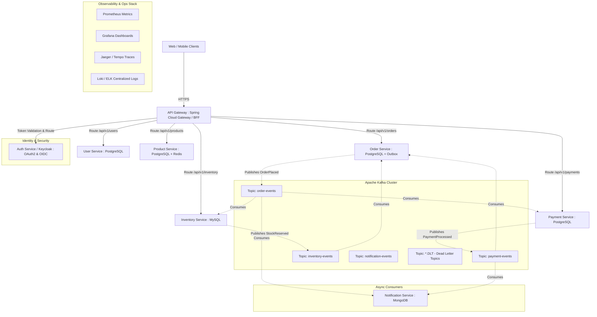

# 🚀 Master 90-Day Production Microservices Roadmap
### Java 21 + Spring Boot 3.x + Spring Cloud + Apache Kafka + Docker + Kubernetes + OpenTelemetry

---

## 🎯 Executive Overview & Philosophy

Building microservices in modern enterprise environments requires much more than spinning up a few Spring Boot apps and connecting them with REST templates. A production-ready microservices engineer must master:
1. **Modern Frameworks & Runtimes**: Java 21 Virtual Threads (Project Loom), Spring Boot 3.x, Jakarta EE 10.
2. **Domain Decomposition & Data Isolation**: Database-per-service, CQRS, Transactional Outbox Pattern, Schema Migrations (Flyway).
3. **Resilience & Fault Isolation**: Circuit Breakers, Bulkheads, Non-blocking retries, Dead Letter Topics (DLT).
4. **Event-Driven Consistency**: Distributed Sagas (Choreography & Orchestration), Exactly-Once semantics, Idempotent Consumers.
5. **Zero-Trust Security**: OAuth2/OIDC, Keycloak/Spring Authorization Server, Token Relay Pattern, Asymmetric JWT (RS256/JWKS).
6. **Unified Observability**: OpenTelemetry, Micrometer Tracing, Prometheus, Grafana, Distributed Tracing (Tempo/Jaeger/Zipkin).
7. **Cloud-Native Deployment**: Multi-stage container builds, Kubernetes (Deployments, Services, ConfigMaps, Ingress, HPA), GitOps CI/CD.

---

## 🏗️ Capstone Architecture: Enterprise E-Commerce Platform

---

## 📅 Complete 90-Day Day-by-Day Implementation Plan

### Phase 1: Clean REST Architecture & Data Isolation (Days 1–14)
**Milestone 1 Output**: `user-service`, `product-service`, `order-service` running independently with isolated databases (PostgreSQL/MySQL), Flyway migrations, clean DTO contracts, and comprehensive validation.

* **Day 1**: Monolith vs. Microservices tradeoffs; Eight Fallacies of Distributed Computing; Microservices architecture vocabulary.
* **Day 2**: Service decomposition strategies: Decomposing by Business Capability vs. Subdomain (DDD Bounded Contexts).
* **Day 3**: Spring Boot 3.x & Java 21 setup; Virtual Threads overview (`spring.threads.virtual.enabled=true`); Modern REST conventions.
* **Day 4**: Clean Onion/Hexagonal Layered Architecture: Domain Entities, Repositories, Services, DTOs, Mappers (MapStruct).
* **Day 5**: Advanced Request Validation (Jakarta Validation) & Global Exception Handling via `@RestControllerAdvice` and RFC 7807 Problem Details (`ProblemDetail` in Spring 6).
* **Day 6**: Polyglot Persistence setup: Spring Data JPA + PostgreSQL container; Database-per-Service isolation rules.
* **Day 7**: Production Database Migrations: Flyway setup; versioned schema migrations (`V1__init.sql`); Git repo structure.
* **Day 8**: Domain-Driven Design (DDD) deep-dive: Aggregates, Value Objects, Domain Events in `product-service`.
* **Day 9**: Implementing `product-service`: Product Catalog CRUD, Category hierarchies, Pagination & Sorting (`Pageable`).
* **Day 10**: Implementing `order-service` Domain Model: Order, OrderItem, OrderStatus (`CREATED`, `PENDING_PAYMENT`, `CONFIRMED`, `CANCELLED`).
* **Day 11**: Order Creation business logic (isolated without inter-service calls yet); Database constraints and indexes.
* **Day 12**: Spring Boot Actuator configuration: `/actuator/health`, `/actuator/info`, readiness and liveness probes.
* **Day 13**: API Documentation with SpringDoc OpenAPI (Swagger UI) for User, Product, and Order services with schema annotations.
* **Day 14**: **Milestone 1 Review**: Test all isolated APIs via Postman collection. Verify zero cross-database queries or shared entities.

---

### Phase 2: Inter-Service Communication & Modern Service Discovery (Days 15–28)
**Milestone 2 Output**: `order-service` dynamically communicates with `user-service` and `product-service` using Spring 6 `RestClient` and OpenFeign with dynamic discovery and client-side load balancing.

* **Day 15**: Synchronous vs. Asynchronous Communication Matrix: Latency, Coupling, Failure propagation, and Network overhead.
* **Day 16**: Spring 6 `RestClient` (The modern replacement for RestTemplate): Fluent API, connection pooling, and timeouts.
* **Day 17**: Declarative HTTP Clients: Spring HTTP Interfaces (`@HttpExchange`) vs. Spring Cloud OpenFeign.
* **Day 18**: Inter-service contract design: Creating dedicated client DTOs; avoiding internal entity leakage.
* **Day 19**: Error Propagation: Handling downstream 4xx/5xx responses with `ResponseStatusException` and Custom Error Decoders.
* **Day 20**: Service Discovery Concept: Client-side vs. Server-side registration; Netflix Eureka internals (Heartbeats, Eviction, Self-preservation).
* **Day 21**: Creating `discovery-server` with Spring Cloud Netflix Eureka Server; Local clustering and configuration.
* **Day 22**: Registering microservices as Eureka Clients (`spring-cloud-starter-netflix-eureka-client`).
* **Day 23**: Service-name resolution: Configuring Feign and `RestClient` to resolve `http://product-service` via discovery.
* **Day 24**: Client-side Load Balancing with Spring Cloud LoadBalancer: Round-robin, Random, and Custom health checks.
* **Day 25**: Cloud-Native Service Discovery Comparison: Why modern Kubernetes uses CoreDNS & K8s Services instead of Eureka.
* **Day 26**: Inter-service timeouts: Configuring connection timeout, read timeout, and socket keep-alive on HTTP clients.
* **Day 27**: Comprehensive Integration Testing: Simulating order checkout with live calls to User and Product services.
* **Day 28**: **Milestone 2 Review**: Kill an instance of `product-service`, run multiple instances on random ports (`server.port=0`), verify traffic routes seamlessly without hardcoded IPs.

---

### Phase 3: API Gateway & Centralized Configuration (Days 29–42)
**Milestone 3 Output**: All external ingress traffic routes through Spring Cloud Gateway with custom filters, CORS, rate limiting, and centralized profile configuration.

* **Day 29**: The API Gateway Pattern: Advantages, Single Point of Failure considerations, Backends-for-Frontends (BFF) pattern.
* **Day 30**: Creating `api-gateway` with Spring Cloud Gateway (Reactive Netty foundation).
* **Day 31**: Route Predicates & Filters: Path routing (`/api/v1/users/**`), RewritePath, and Header manipulation.
* **Day 32**: Dynamic Discovery Routing: Configuring Gateway to route dynamically using `lb://PRODUCT-SERVICE`.
* **Day 33**: Global Logging & Correlation Filter: Injecting `X-Correlation-ID` header at the gateway and propagating downstream.
* **Day 34**: Cross-Origin Resource Sharing (CORS) setup: Configuring allowed origins, methods, and credentials for frontends.
* **Day 35**: Distributed Rate Limiting: Spring Cloud Gateway Redis RateLimiter using the Token Bucket Algorithm.
* **Day 36**: Centralized Configuration concept: Eliminating configuration drift across 10+ microservices.
* **Day 37**: Building `config-server` with Spring Cloud Config; Setting up Git-backed and native profile repositories.
* **Day 38**: Creating hierarchical configuration YAMLs (`application.yml` for shared configs, `order-service-dev.yml` for overrides).
* **Day 39**: Connecting services as Config Clients; Encrypting sensitive configuration keys with symmetric/asymmetric ciphers.
* **Day 40**: Dynamic Configuration Refresh: `@RefreshScope` and `/actuator/refresh` webhook triggers.
* **Day 41**: Secret Management in Enterprise: When to use Spring Cloud Config vs. HashiCorp Vault / AWS Secrets Manager / K8s Secrets.
* **Day 42**: **Milestone 3 Review**: Route 100% of Postman traffic exclusively through `http://localhost:8080/api/...`. Trigger rate limit violation (HTTP 429).

---

### Phase 4: Enterprise Security with OAuth2, OIDC & Resilience (Days 43–56)
**Milestone 4 Output**: Production-grade authentication using Keycloak / Spring Authorization Server with RS256 asymmetric JWT validation, Token Relay at Gateway, and Resilience4j fault tolerance.

* **Day 43**: Security Architecture: Why symmetric JWTs fail in large teams; OAuth2.0 & OpenID Connect (OIDC) fundamentals.
* **Day 44**: Setting up `auth-service` / Keycloak container: Realms, Clients, Roles (`ROLE_CUSTOMER`, `ROLE_ADMIN`), Scopes.
* **Day 45**: User Authentication Flow: Login, Refresh Token rotation, Authorization Code Flow with PKCE.
* **Day 46**: Gateway Security: Configuring Spring Cloud Gateway as an OAuth2 Resource Server / Token Relay.
* **Day 47**: Asymmetric JWT Validation: Using JWKS (`.well-known/jwks.json`) to verify signatures downstream without calling Auth service.
* **Day 48**: Method-Level Security: Role-Based Access Control (`@PreAuthorize("hasRole('ADMIN')")`) in Product & Order services.
* **Day 49**: Propagating User Identity: Extracting JWT claims (`sub`, `roles`, `email`) into custom headers (`X-User-Id`) for microservices.
* **Day 50**: Cascading Failure Theory: Why one slow service can exhaust thread pools across an entire microservice fleet.
* **Day 51**: Resilience4j Circuit Breaker: States (`CLOSED`, `OPEN`, `HALF_OPEN`), failure rate thresholds, sliding window metrics.
* **Day 52**: Implementing Circuit Breaker on Order -> Product and Order -> Payment calls with graceful fallback responses.
* **Day 53**: Resilience4j Retry: Exponential backoff, jitter calculation, and configuring retry only on idempotent/safe HTTP methods (GET, PUT).
* **Day 54**: Resilience4j TimeLimiter & Bulkhead: Isolating thread pools / concurrent calls per downstream dependency.
* **Day 55**: Chaos Engineering drill: Using Toxiproxy or Docker network delays to inject 5000ms latency into Product Service.
* **Day 56**: **Milestone 4 Review**: Run stress test against Gateway. Confirm unauthorized calls get 401/403, and slow dependencies trigger Circuit Breaker fallback within 500ms.

---

### Phase 5: Event-Driven Architecture & Distributed Sagas (Days 57–70)
**Milestone 5 Output**: Fully decoupled asynchronous event flow powered by Apache Kafka, implementing the Saga Pattern with compensation logic, Transactional Outbox, and Idempotent Consumers.

* **Day 57**: Event-Driven Architecture (EDA) Principles: Choreography vs. Orchestration, Event Notification vs. Event-Carried State Transfer.
* **Day 58**: Apache Kafka Architecture: Topics, Partitions, Consumer Groups, Offsets, Broker Replication, and ZooKeeper vs. KRaft mode.
* **Day 59**: Spinning up Kafka Cluster with Docker Compose (KRaft mode); Kafka UI (AKHQ or Provectus Kafka-UI) for inspection.
* **Day 60**: Spring for Apache Kafka (`spring-kafka`): `KafkaTemplate` producer configuration, Serializers, ACK modes (`acks=all`).
* **Day 61**: The Dual-Write Problem: Why updating DB and publishing to Kafka in a single `@Transactional` method is an anti-pattern.
* **Day 62**: **The Transactional Outbox Pattern**: Designing an `outbox` table, polling publisher, or Change Data Capture (CDC with Debezium).
* **Day 63**: Publishing `OrderPlacedEvent` from `order-service` using the Outbox pattern.
* **Day 64**: Building `payment-service`: Consuming `OrderPlacedEvent`, charging simulated card, publishing `PaymentSuccessEvent` or `PaymentFailedEvent`.
* **Day 65**: Building `inventory-service`: Consuming events, reserving SKU stock, publishing `InventoryReservedEvent` or `InventoryDepletedEvent`.
* **Day 66**: Building `notification-service`: Consuming events to trigger asynchronous email/SMS notifications (storing audit logs in MongoDB).
* **Day 67**: **The Saga Pattern (Choreography)**: Implementing compensation transactions:
  * Happy Path: `OrderPlaced` -> `PaymentCompleted` -> `InventoryReserved` -> Order marked `CONFIRMED`.
  * Failure Path: Payment succeeds, but Inventory fails -> Trigger `CancelPaymentEvent` (Refund) -> Order marked `CANCELLED`.
* **Day 68**: Consumer Idempotency: Designing an `idempotency_keys` table to guarantee that duplicate Kafka events never cause double-charges.
* **Day 69**: Advanced Kafka Error Handling: Non-blocking retries with `@RetryableTopic`, backoff intervals, and Dead Letter Topics (`order-events.DLT`).
* **Day 70**: **Milestone 5 Review**: Simulate a payment decline and an out-of-stock condition. Verify that Saga compensations execute cleanly and state remains consistent across all 3 databases.

---

### Phase 6: CQRS, Caching & Unified Observability (Days 71–85)
**Milestone 6 Output**: Full observability stack with OpenTelemetry, Prometheus, Grafana, and Loki; Distributed Caching with Redis; CQRS read-projection service.

* **Day 71**: The Cross-Service Query Problem: Why distributed joins across microservices are impossible; CQRS pattern fundamentals.
* **Day 72**: Implementing CQRS: Creating a dedicated Order-Query Read View in Redis / Elasticsearch populated by Kafka events.
* **Day 73**: Distributed Caching with Redis: Cache-Aside pattern in `product-service`, cache invalidation, and TTL strategies.
* **Day 74**: Cache Stampede & Distributed Locking: Using Redisson for distributed locks during high-concurrency inventory updates.
* **Day 75**: Observability Pillars: Logs vs. Metrics vs. Traces.
* **Day 76**: Structured Logging: Logback JSON encoder, logging context (MDC), and forwarding logs to Grafana Loki / ELK.
* **Day 77**: Distributed Tracing with Micrometer Tracing & OpenTelemetry: Propagating W3C TraceContext (`traceparent`, `tracestate`).
* **Day 78**: Visualizing distributed traces across Gateway -> Order -> Kafka -> Payment using Jaeger / Grafana Tempo.
* **Day 79**: Metrics Instrumentation: Spring Boot Actuator + Micrometer Prometheus registry; Exposing custom business metrics (orders placed/min, revenue counter).
* **Day 80**: Prometheus Configuration: Scraping all microservice `/actuator/prometheus` endpoints.
* **Day 81**: Grafana Dashboard Engineering: Creating unified dashboards for JVM heap, garbage collection, HTTP request rates (RED method), and Kafka consumer lag.
* **Day 82**: Contract Testing with Pact: Writing consumer-driven contract tests between `order-service` and `product-service` to catch breaking API changes before PR merge.
* **Day 83**: Integration Testing with **Testcontainers**: Running tests against real PostgreSQL and Kafka Docker containers in CI.
* **Day 84**: Multi-stage Dockerfile optimization: Using Eclipse Temurin JRE, non-root user security, and JVM container flags (`-XX:MaxRAMPercentage=75.0`).
* **Day 85**: **Milestone 6 Review**: Single-command startup with `docker compose up -d` for all 10 services, databases, Kafka, Prometheus, and Grafana.

---

### Phase 7: Kubernetes, Cloud-Native Deployment & CI/CD (Days 86–90)
**Milestone 7 Output**: Production Kubernetes manifests (Deployments, Services, ConfigMaps, Secrets, Ingress, HPA), GitHub Actions automated CI/CD pipeline, and polished architectural portfolio.

* **Day 86**: Kubernetes Core Concepts: Pods, Deployments, ReplicaSets, Services (ClusterIP, NodePort, LoadBalancer), and Namespaces.
* **Day 87**: Writing Production K8s Manifests: Resource requests/limits, Liveness/Readiness probes mapped to Actuator, Graceful shutdown (`server.shutdown=graceful`).
* **Day 88**: Externalizing Configuration: Kubernetes `ConfigMaps` and `Secrets`; Ingress Controller (Nginx Ingress) routing external traffic to `api-gateway`.
* **Day 89**: Auto-scaling & Zero Downtime: Horizontal Pod Autoscaler (HPA) based on CPU/Memory thresholds; Rolling Updates without dropped requests.
* **Day 90**: Automated CI/CD with GitHub Actions: Build JAR, run Unit & Testcontainers tests, build & scan Docker images, push to container registry, and deploy manifests.

---

## 🏆 Post-Roadmap 7-Day Interview Masterclass

| Day | Topic | Key Interview Answers & War Stories |
| :--- | :--- | :--- |
| **R1** | **Decomposition & Boundaries** | Explain why you chose Database-per-Service over a shared DB. Discuss the Strangler Fig pattern for monolith migration. |
| **R2** | **Sync vs. Async Protocols** | When to choose REST vs. gRPC vs. Kafka. Detail latency, throughput, and operational complexity trade-offs. |
| **R3** | **Distributed Transactions** | Explain 2-Phase Commit (2PC) failure points vs. Saga Pattern. Walk through how your compensating transactions undo partial writes. |
| **R4** | **Dual-Write Problem & Outbox** | Diagram the Transactional Outbox Pattern with Debezium/Polling to prevent lost Kafka events when database commits succeed. |
| **R5** | **Zero-Trust Security & Token Relay** | Explain why symmetric JWTs are an enterprise liability; detail asymmetric RS256/JWKS validation and Gateway Token Relay. |
| **R6** | **Fault Tolerance & Cascading Failures** | Explain how Resilience4j Circuit Breakers and Bulkhead thread isolation prevent downstream outages from crashing the system. |
| **R7** | **Live System Demo & War Stories** | Live walkthrough: Kill the payment service, place an order, demonstrate Circuit Breaker fallback, trace the error in Jaeger, and inspect consumer lag in Kafka. |

---

## 💡 Production Readiness Checklist: Enterprise Scorecard

| Category | Production Requirement | Standard / Implementation |
| :--- | :--- | :--- |
| **Architecture** | Database Isolation | Strict Database-per-service; zero cross-database SQL joins. |
| **Architecture** | Schema Migrations | Flyway or Liquibase versioned scripts checked into git. |
| **API Quality** | Error Specifications | RFC 7807 Problem Details for all HTTP 4xx/5xx responses. |
| **Communication**| Client Strategy | Spring 6 `RestClient` or HTTP Interfaces; configured timeouts on every call. |
| **Resilience** | Circuit Breaker & Fallbacks | Resilience4j wrapping all inter-service remote I/O. |
| **Resilience** | Safe Retries | Retries only on idempotent operations with exponential backoff & jitter. |
| **Events** | Exactly-Once / Idempotency | Idempotent consumers with deduplication keys; Outbox pattern for publishing. |
| **Events** | Error Handling | `@RetryableTopic` + Dead Letter Topics (DLT) for poisoned pills. |
| **Security** | Authentication | OAuth2.0 / OIDC with asymmetric JWT signature verification (RS256/JWKS). |
| **Security** | Sensitive Data | Zero plaintext credentials in git; externalized via Secrets/Vault. |
| **Observability** | Distributed Tracing | OpenTelemetry / W3C `traceparent` context propagated across all HTTP & Kafka hops. |
| **Observability** | Metrics & Alerts | Prometheus scraping `/actuator/prometheus`; Grafana RED method dashboards. |
| **Deployment** | Health & Graceful Shutdown | K8s Liveness & Readiness probes; `server.shutdown=graceful` configured. |
| **Testing** | Real World Isolation | Testcontainers for PostgreSQL and Kafka in automated CI/CD pipeline. |
